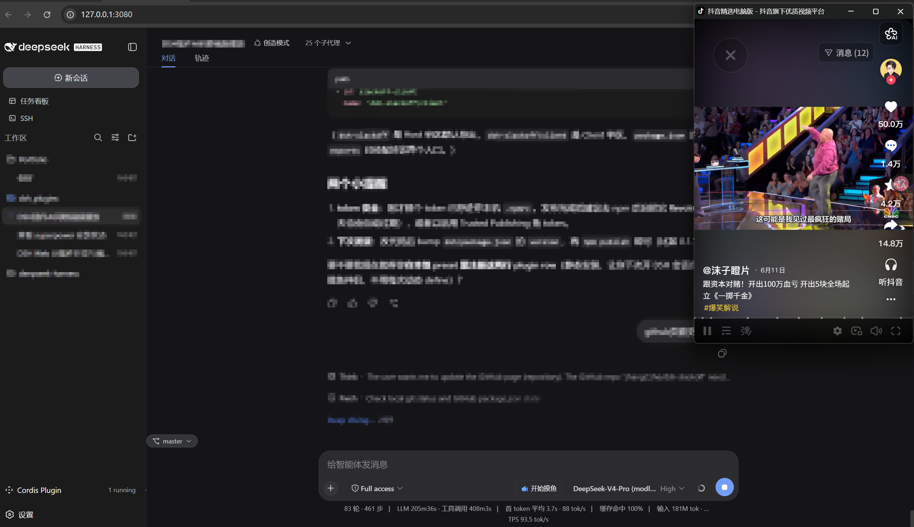
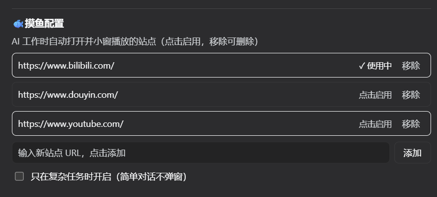
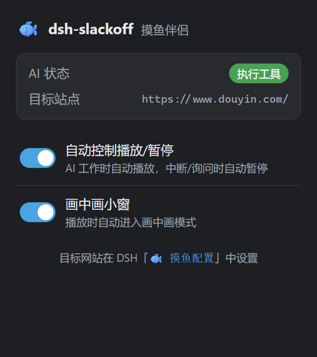

<div align="center">

# 🐟 dsh-slackoff

**摸鱼伴侣 —— AI 干活时，自动弹出视频小窗陪你摸鱼**

[]()
[]()
[](./LICENSE)

</div>

---

## 这是什么

**dsh-slackoff**（摸鱼伴侣）是一个「AI 工作间隙自动摸鱼」小工具：

- 🏃 **AI 开始思考 / 调用工具** → 屏幕右侧自动弹出一个小窗，开始播放视频
- 🛑 **AI 中断 / 暂停 / 向你询问** → 视频自动暂停，把声音和注意力还给你

> 真实视频站页面完整保留——弹幕、评论、推荐、进度条，全都在，不是阉割版内嵌播放器。

---

## ✨ 特性

| | |
|---|---|
| ⏯️ 自动播放 / 自动暂停 | 完全跟随 AI 状态，零手动操作 |
| 🪟 小窗常驻 | 右侧 420×640 常驻小窗，不遮挡主界面 |
| 🖼️ 画中画 | 播放时自动进入画中画（可选开关） |
| 🌐 多站点 | B 站 / YouTube / TikTok 等 |
| 🐟 一键摸鱼 | 输入框旁「开始摸鱼」按钮，随时手动唤起 |
| 🎯 聚焦即暂停 | 点击输入框准备打断时，自动暂停 |
| 🔧 可配置 | 目标站点列表动态增删；「只在复杂任务时开启」 |

---

## 📸 效果预览

AI 工作时，右侧自动弹出视频小窗并播放；AI 中断 / 询问时自动暂停。

<div align="center">
  
</div>

**摸鱼配置**（DSH 设置 → 通用）：站点列表可增删、点击启用，「只在复杂任务时开启」。

<div align="center">
  
</div>

**扩展设置面板**（Chrome 工具栏 🐟 图标）：实时显示 AI 状态与目标站点，开关自动控制与画中画。

<div align="center">
  
</div>

---

## 🎬 工作原理

**DSH 插件**（`dsh/`）监听 Agent 事件（思考 / 调用工具 / 审批 / 结束），经状态机归纳为 `thinking · tool · awaiting · idle` 四态，并通过 `GET /slackoff/state` 暴露。

**Chrome 扩展**（`extension/`）在 DSH 页轮询这个状态，经后台路由到视频站页面，调用真实 `<video>` 的 `play()` / `pause()`，并支持画中画。

---

## 🌐 支持的站点

Bilibili · YouTube · TikTok · Douyin · Vimeo · Dailymotion · Twitter(X) · Facebook · Instagram · Reddit · Twitch

---

## 🚀 安装

### 前置条件

- Chrome（MV3，≥ Chrome 111）
- 一个运行中的 DSH 会话（`http://127.0.0.1:3080`）
- Node.js ≥ 18

### 1️⃣ 安装 Chrome 扩展

```bash
# 克隆仓库
git clone https://github.com/zhangCzhe/dsh-slackoff.git
cd dsh-slackoff

# 打包扩展源码 → extension/dist/
npm install               # 安装 esbuild
npm run build:extension   # 或零依赖方式：node build-extension-nospawn.mjs
```

然后加载到 Chrome：

1. 打开 `chrome://extensions`
2. 打开右上角 **「开发者模式」**
3. 点 **「加载已解压的扩展程序」**
4. 选择本仓库的 `extension/` 目录（含 `manifest.json` 的那一层）

> ✅ 验证：工具栏出现 🐟 图标；点它应弹出设置面板并显示「AI 状态 / 目标站点」。

### 2️⃣ 安装 DSH 插件

```bash
npm install dsh-slackoff
```

> 扩展默认从 `http://127.0.0.1:3080/slackoff/state` 读状态，两端需在同机配对。

---

## 🎮 使用

1. 打开 DSH 会话页面（`127.0.0.1:3080`）。
2. 侧边栏 → 设置 → **「🐟 摸鱼配置」**，添加目标站点（B 站 / YouTube 链接），设为「使用中」。
3. 让 AI 开始一个任务 → 右侧自动弹出小窗并播放。
4. AI 询问 / 中断 / 回合结束 → 视频自动暂停。
5. 想手动摸鱼？点输入框旁的 **「🐟 开始摸鱼」** 按钮。

### 首次播放授权

浏览器自动播放策略要求一次用户手势。首次使用时点一下视频页即可解锁有声自动播放（TikTok 会自动以静音起步）。

---

## ⚠️ 已知限制

- **自动播放策略**：首次有声播放需一次用户手势。
- **抖音**：feed 首页是反爬「预创建占位」播放器，无法自动加载源；请改用 `/video/<id>` 详情页链接。
- **站点改版**：视频站 DOM 变更可能导致 `<video>` 选择器失效，更新 `extension/src/selectors.js` 即可。
- **MV3**：后台 service worker 可能被挂起；状态桥已放在 DSH 页 content script 规避。

---

## 📁 目录结构

```
dsh-slackoff/
├── package.json                # 根包：test / build:extension
├── build-extension.mjs         # esbuild 打包脚本
├── build-extension-nospawn.mjs # 零依赖打包脚本（无 esbuild 环境可用）
├── dsh/                        # DSH 插件
│   ├── host.js                 #   Host：事件 → 状态机 → 端点
│   ├── client.js               #   Client：按钮 + 配置面板
│   ├── client.css
│   ├── state-machine.js        #   状态机（纯逻辑）
│   └── package.json            #   可分发包清单
├── extension/                  # Chrome 扩展
│   ├── manifest.json
│   └── src/
│       ├── background.js       #   service worker 路由
│       ├── dsh-bridge.js       #   DSH 页状态桥
│       ├── site-controller.js  #   视频站控制 + 画中画
│       ├── selectors.js        #   视频选择器
│       ├── decision.js         #   播放决策 + 去重
│       ├── shadow-patch.js     #   强制开放 shadow root
│       ├── options.html / .js  #   扩展设置面板
└── test/                       # node --test 纯逻辑测试
```

---

## 🛠 开发

```bash
npm test                # 跑纯逻辑测试（状态机 / 决策 / 选择器 / 端点）
npm run build:extension # 打包扩展
```

---

## 📄 License

[MIT](./LICENSE)
